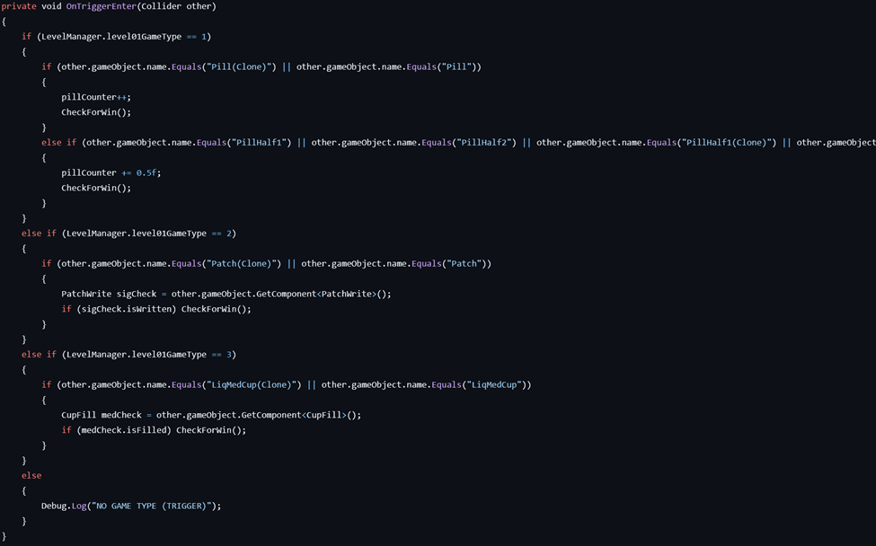

## Player Experience Goal\

The mechanic should only display success to the player when all parts of the level have been fully completed, as the level is meant to function like a test that occurs in real life.

## Controls

PC with keyboard and mouse and VR controls are supported.

## Game Context

This is used to support the gameplay of the first level.

## Software and Language

Unity/C#

## Collaboration Note

This code was jointly created with Daniel Germond.

## Core Script

MedtrayTracker.cs

## Code Snippet

## Tuning Variables

Booleans used to track progress

### Resources
- [Repository](https://github.com/csg-utulsa/VR-Nursing-Training-U6-NEWREPO)
- [Game](https://blue-dragon-games.itch.io/vr-nursing-training-unity-6-version)